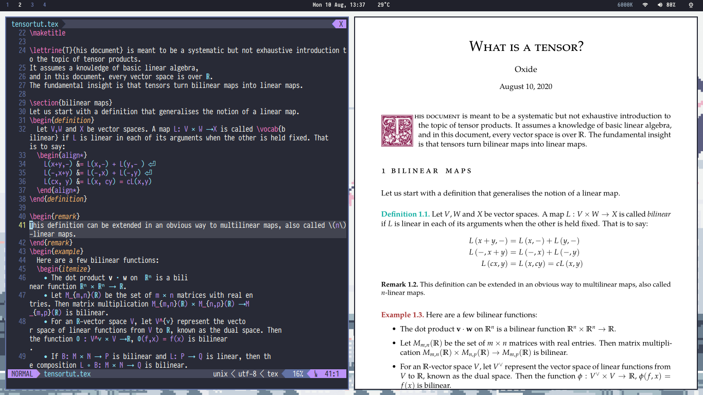

These dotfiles are managed by GNU Stow and contain my configurations for:
- WM : xmonad, i3
- Terminal: st, Terminator
- Editor: vim, emacs
- Shell: zsh
- Bar: polybar
- IRC client: weechat
- File viewer: ranger
- Multiplexer: tmux
- PDF reader: Zathura

plus miscellaneous scripts and my LaTeX preamble.

To set the colorscheme system-wide, use `wal --backend colorthief -i Pictures/led.jpg -n -o scripts/reload_dunst.sh`.

Because I forget how to use GNU Stow every time I need to use it again, I am placing [this guide](https://alexpearce.me/2016/02/managing-dotfiles-with-stow/) for my future self.

## Screenshots (may be out-of-date)

### LaTeX workflow

### Clean

