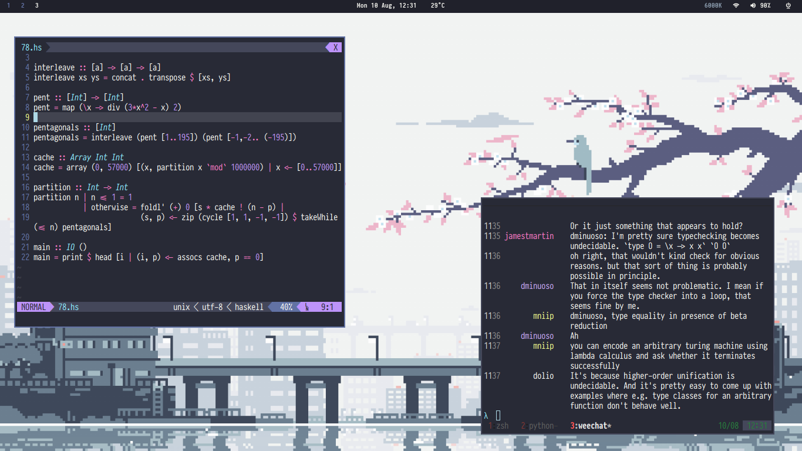
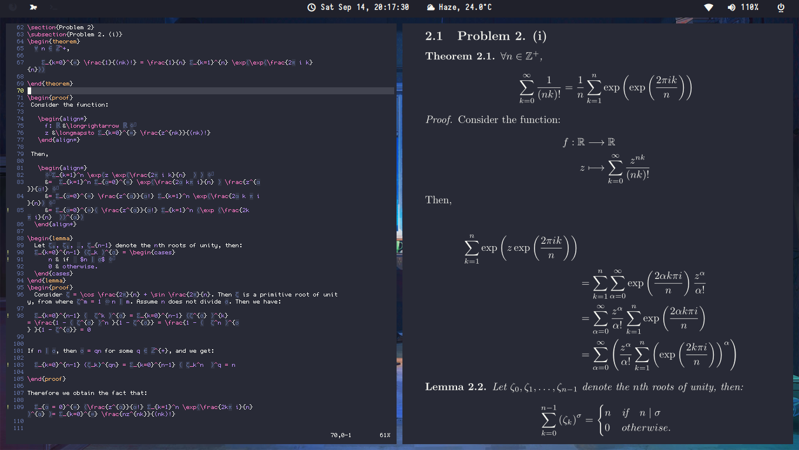

These dotfiles are managed by GNU Stow and contain my configurations for:
- WM : [xmonad](https://xmonad.org/)
- Editor: [vim](https://www.vim.org/)
- Shell: [zsh](https://github.com/ohmyzsh/ohmyzsh)
- Bar: [polybar](https://github.com/polybar/polybar)
- IRC Client: [weechat](https://weechat.org/)
- File Viewer: [ranger](https://github.com/ranger/ranger)
plus miscellaneous scripts and my LaTeX preamble.

Because I forget how to use GNU Stow every time I need to use it again, I am placing [this](https://alexpearce.me/2016/02/managing-dotfiles-with-stow/) for my future self.

Most of the due credit goes to the people from whom I copied from and modified the dotfiles for my own use.

## Screenshots (may be out-of-date)

### LaTeX workflow

### Clean

